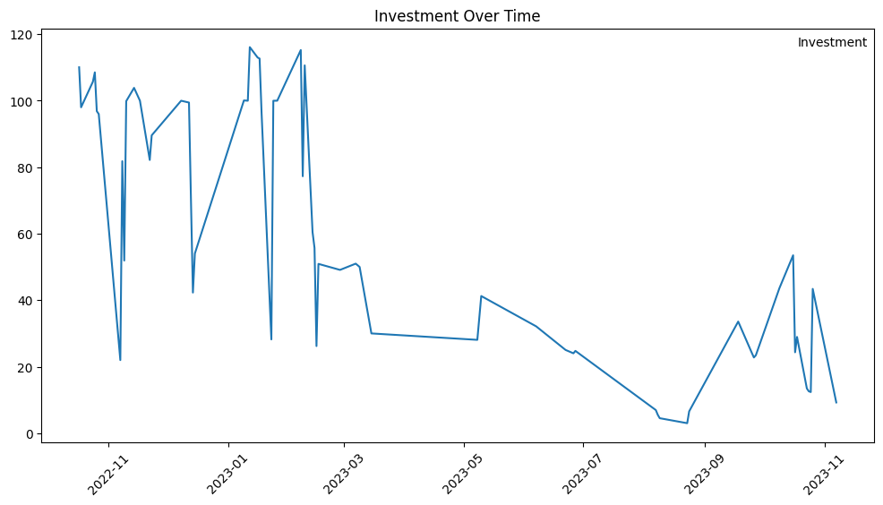
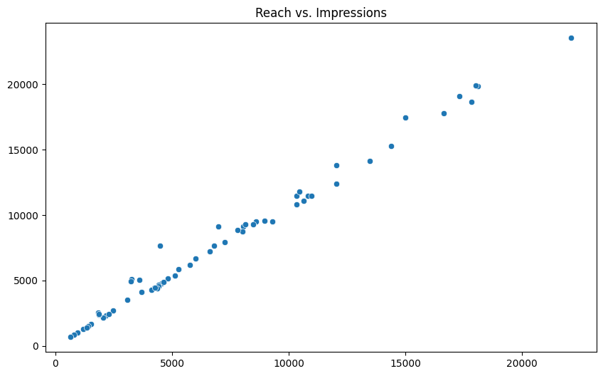
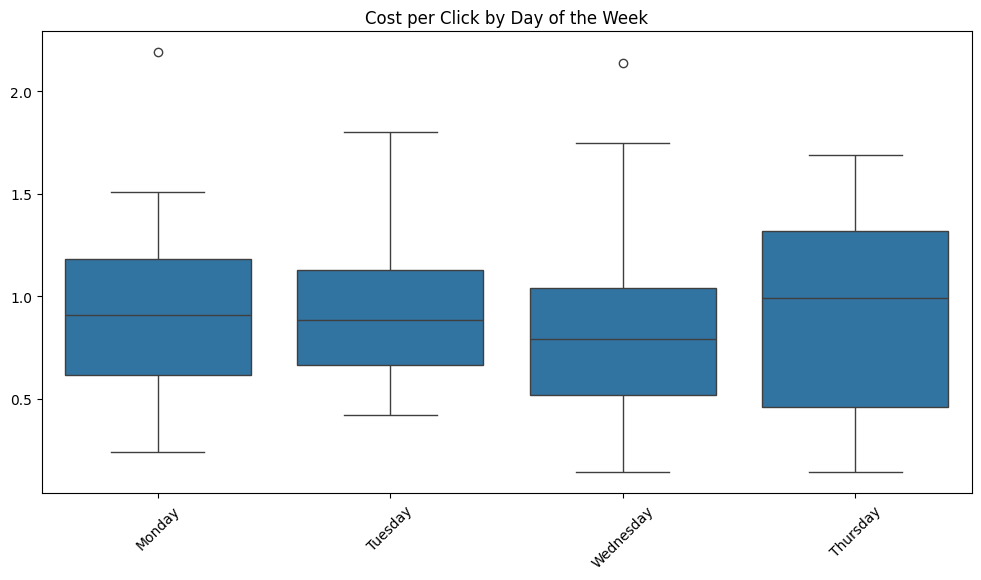
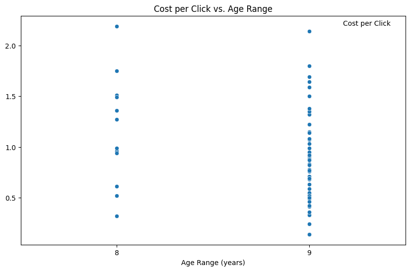
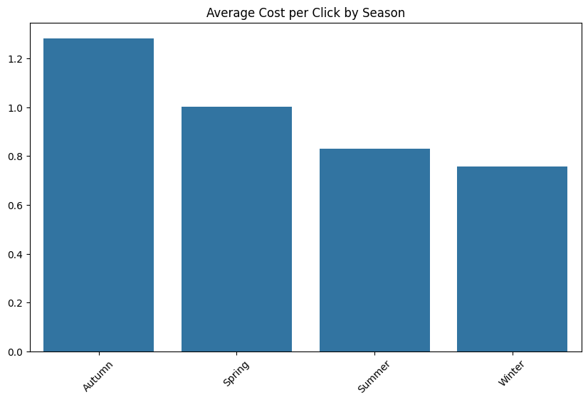
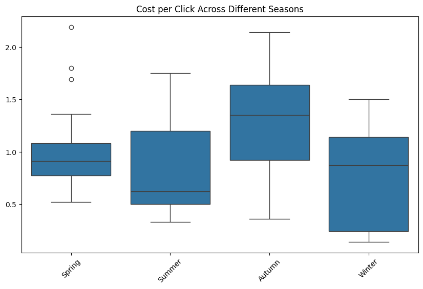

# CHECKING TRENDS OF INCA SUSHI AD DATA

After carefully addressing customer income seasonality in the last phase, now we can visualize our data to see if we can spot the impact of Inca Sushi advertising on customer behavior, removing the higher conversion tendencies of when people temporarilly feel richer.

## Environment Set Up 


```python
import pandas as pd
import numpy as np
import matplotlib.pyplot as plt
import seaborn as sns
```


```python
df = pd.read_csv('ads_inca_sushi_final.csv')

print(df.head())
```

             Date  Reach  Impressions  Clicks  Investment    Avg Youngest Client  \
    0  10/17/2022  10340        11479     155   BRL 110.06                    30   
    1  10/18/2022   8038         9123     110    BRL 98.02                    30   
    2  10/24/2022   8137         9268     154   BRL 105.70                    30   
    3  10/25/2022   8597         9521     139   BRL 108.53                    30   
    4  10/26/2022   8006         8743     181    BRL 96.86                    30   
    
       Avg Oldest Client  Cost per Reach   Cost per Impression  Cost per Click  \
    0                 39        BRL 0.01              BRL 0.01       BRL 0.71    
    1                 39        BRL 0.01              BRL 0.01       BRL 0.89    
    2                 39        BRL 0.01              BRL 0.01       BRL 0.69    
    3                 39        BRL 0.01              BRL 0.01       BRL 0.78    
    4                 39        BRL 0.01              BRL 0.01       BRL 0.54    
    
      Seasonality (week) Seasonality (month) Seasonality (year)  
    0             Monday         Regular Day             Spring  
    1            Tuesday         Regular Day             Spring  
    2             Monday         Regular Day             Spring  
    3            Tuesday         Regular Day             Spring  
    4          Wednesday         Regular Day             Spring  
    


```python
df.dtypes
```


    Date                     object
    Reach                     int64
    Impressions               int64
    Clicks                    int64
     Investment              object
    Avg Youngest Client       int64
    Avg Oldest Client         int64
     Cost per Reach          object
     Cost per Impression     object
    Cost per Click           object
    Seasonality (week)       object
    Seasonality (month)      object
    Seasonality (year)       object
    dtype: object


### Quick Fixes


```python
# Strip any leading/trailing spaces in column names
df.columns = df.columns.str.strip()

# List of columns to clean
columns_to_clean = ['Investment', 'Cost per Reach', 'Cost per Impression', 'Cost per Click']

# Remove 'BRL', convert to float, and round to two decimal places
for column in columns_to_clean:
    df[column] = (
        df[column]
        .str.replace('BRL', '', regex=True)  # Remove 'BRL'
        .str.strip()  # Remove extra spaces
        .astype(float)  # Convert to float
        .round(2)  # Round to two decimal places
    )

# Verify the cleaned columns
print(df[columns_to_clean].head())
```

       Investment  Cost per Reach  Cost per Impression  Cost per Click
    0      110.06            0.01                 0.01            0.71
    1       98.02            0.01                 0.01            0.89
    2      105.70            0.01                 0.01            0.69
    3      108.53            0.01                 0.01            0.78
    4       96.86            0.01                 0.01            0.54
    

### Gathering up the new DataFrame


```python
# Select the original columns that were not cleaned
other_columns = [
    'Date', 'Reach', 'Impressions', 'Clicks', 'Avg Youngest Client',
    'Avg Oldest Client', 'Seasonality (week)', 'Seasonality (month)', 'Seasonality (year)'
]

# Combine both sets of columns into a new DataFrame
new_df = df[other_columns + columns_to_clean]

# Verify the new DataFrame
print(new_df.head())

```

             Date  Reach  Impressions  Clicks  Avg Youngest Client  \
    0  10/17/2022  10340        11479     155                   30   
    1  10/18/2022   8038         9123     110                   30   
    2  10/24/2022   8137         9268     154                   30   
    3  10/25/2022   8597         9521     139                   30   
    4  10/26/2022   8006         8743     181                   30   
    
       Avg Oldest Client Seasonality (week) Seasonality (month)  \
    0                 39             Monday         Regular Day   
    1                 39            Tuesday         Regular Day   
    2                 39             Monday         Regular Day   
    3                 39            Tuesday         Regular Day   
    4                 39          Wednesday         Regular Day   
    
      Seasonality (year)  Investment  Cost per Reach  Cost per Impression  \
    0             Spring      110.06            0.01                 0.01   
    1             Spring       98.02            0.01                 0.01   
    2             Spring      105.70            0.01                 0.01   
    3             Spring      108.53            0.01                 0.01   
    4             Spring       96.86            0.01                 0.01   
    
       Cost per Click  
    0            0.71  
    1            0.89  
    2            0.69  
    3            0.78  
    4            0.54  
    


```python
# Convert the Date column to datetime format
new_df['Date'] = pd.to_datetime(new_df['Date'], format='%m/%d/%Y')

# Verify the change
print(new_df['Date'].head())
```

    0   2022-10-17
    1   2022-10-18
    2   2022-10-24
    3   2022-10-25
    4   2022-10-26
    Name: Date, dtype: datetime64[ns]
    

## Spotting General Trends


```python
# Investment trend over time
plt.figure(figsize=(12, 6))
sns.lineplot(data=new_df, x='Date', y='Investment')
plt.title('Investment Over Time')
plt.xlabel('')  # Remove x-axis label
plt.ylabel('Investment', rotation=360)  # Adjust the y-axis label
plt.gca().yaxis.set_label_coords(0.95, 0.95)  # Reposition the y-axis label to the upper right corner
plt.xticks(rotation=45)  # Rotate date labels if needed
plt.show()

# Reach vs. Impressions
plt.figure(figsize=(10, 6))
sns.scatterplot(data=new_df, x='Reach', y='Impressions',)
plt.title('Reach vs. Impressions')
plt.xlabel('')
plt.ylabel('')
plt.show()
```


    

    


    

    


### Key Takeaways:

1) From these charts, there is not much to assume. I know I substantially decreased my ad expenditure in the months prior to the closing of the restaurant. Reach and impressions are usually very correlated, which explains the fitting to the curve.
   
2) Nonetheless, **we can still conclude that the data has no gaps or anomalities**, since the most obvious relationships are visible.

## Trends Accross Weekdays


```python
# Plot cost per click across days of the week using seaborn
plt.figure(figsize=(12, 6))
sns.boxplot(x='Seasonality (week)', y='Cost per Click', data=new_df, order=['Monday', 'Tuesday', 'Wednesday', 'Thursday'])
plt.title('Cost per Click by Day of the Week')
plt.xlabel('')
plt.ylabel('')
plt.xticks(rotation=45)
plt.show()
```


    

    


### Key Takeaways
 
1) **Variability and Range:**

a) Monday shows a relatively high median cost per click (CPC), with a smaller interquartile range (IQR), indicating consistent but higher costs on this day.

b) Tuesday and Thursday show a lower median CPC compared to Monday, with Tuesday having a slightly wider IQR. This suggests more variability in CPC on these days.

c) Wednesday has the lowest median CPC of the weekdays shown. Its IQR is comparable to Tuesday's, showing some variability but consistently lower costs.


2) **Outliers:**

Thursday has outliers that indicate occasional spikes in CPC, suggesting that while the median CPC is generally moderate, there are instances of much higher costs.


3) **Cost Efficiency:**

a) Based on median values and the spread (IQR), Wednesday might be the most cost-effective day to invest in ads regarding CPC, offering lower costs on average and fewer extreme values.
b) Monday, despite its higher costs, could be viewed as less variable and potentially offering a more predictable ad performance, though this would require further context such as the conversion rate or the return on investment (ROI) for a more comprehensive understanding.


4) **Strategic Implications:**

a) If budget efficiency is a priority, focusing more of your ad spend on Wednesday could be beneficial.
b) For days like Thursday, it might be useful to delve deeper into what causes the spikes in CPC—whether it's due to market competition, increased ad engagement, or other factors.

## Trends Relative to Age Spread


```python
# Calculate the age range between youngest and oldest clients
new_df['Age Range'] = new_df['Avg Oldest Client'] - new_df['Avg Youngest Client']

# Display the first few rows to confirm the new column
print(new_df[['Avg Youngest Client', 'Avg Oldest Client', 'Age Range']].head())

```

       Avg Youngest Client  Avg Oldest Client  Age Range
    0                   30                 39          9
    1                   30                 39          9
    2                   30                 39          9
    3                   30                 39          9
    4                   30                 39          9
    


```python
# Now let's visualize it

# Scatter plot of Age Range vs. Cost per Click
plt.figure(figsize=(10, 6))
sns.scatterplot(data=new_df, x='Age Range', y='Cost per Click')
plt.title('Cost per Click vs. Age Range')
plt.xlabel('Age Range (years)')
plt.ylabel('Cost per Click', rotation=0, labelpad=20)
plt.gca().yaxis.set_label_coords(0.90, 0.95)

# Set x-ticks to be integer values within the range of 'Age Range'
plt.xticks(np.arange(new_df['Age Range'].min(), new_df['Age Range'].max() + 1, 1))

# Set x-axis limits to focus on Age Ranges 8 to 9
plt.xlim(7.5, 9.5)  # Adding a little padding for visual clarity

plt.xticks([8, 9])  # Show specific ticks for age range 8 and 9

plt.show()

```


    

    


It seems that the spread of ages between the target group, which lies around 30-40, is not really significant in performance. It could be an indicator that we are targeting the appropriate audience. 

### Let's take a look at the correlation between them just to make sure


```python
# Calculate Spearman's rank correlation coefficient
spearman_correlation = new_df['Age Range'].corr(new_df['Cost per Click'], method='spearman')
print("Spearman's rank correlation coefficient between Age Range and Cost per Click:", spearman_correlation)

# Calculate Kendall's tau correlation coefficient
kendall_tau_correlation = new_df['Age Range'].corr(new_df['Cost per Click'], method='kendall')
print("Kendall's tau correlation coefficient between Age Range and Cost per Click:", kendall_tau_correlation)

```

    Spearman's rank correlation coefficient between Age Range and Cost per Click: -0.22343833855974563
    Kendall's tau correlation coefficient between Age Range and Cost per Click: -0.18432487414673293
    

Like expected, the correlation is very weak.
For a further inspection into the age of the ideal customer, it would be necessary to run A/B tests during the ongoing campaign, which was not done at the time, so I do not have this data to make an estimated model.

### Finally, let's take a look on how different weather seasons accross the year might have an impact on CPC


```python
# Step 1: Grouping Data
seasonal_cpc = new_df.groupby('Seasonality (year)')['Cost per Click'].agg(['mean', 'median'])

# Step 2: Visualization with a Bar Chart for Mean CPC
plt.figure(figsize=(10, 6))
sns.barplot(x=seasonal_cpc.index, y=seasonal_cpc['mean'])
plt.title('Average Cost per Click by Season')
plt.xlabel('')
plt.ylabel('')
plt.xticks(rotation=45)  # Ensures that season names are readable
plt.show()

# Visualization with a Box Plot for overall distribution
plt.figure(figsize=(10, 6))
sns.boxplot(x='Seasonality (year)', y='Cost per Click', data=new_df)
plt.title('Cost per Click Across Different Seasons')
plt.xlabel('')
plt.ylabel('')
plt.xticks(rotation=45)
plt.show()

# Step 3: Statistical Analysis 
from scipy.stats import f_oneway

# One-way ANOVA test across seasons
season_groups = [group['Cost per Click'].values for name, group in new_df.groupby('Seasonality (year)')]
f_stat, p_value = f_oneway(*season_groups)
print("ANOVA test results - F-statistic: {:.2f}, p-value: {:.4f}".format(f_stat, p_value))
```


    

    


    

    


    ANOVA test results - F-statistic: 1.98, p-value: 0.1268
    

### Key takeaways:

1) **Graph Interpretations:**

a) Average Cost per Click by Season (Bar Chart)

Autumn shows the highest average CPC, followed by Spring, Summer, and Winter. This could indicate that advertising costs are generally higher in Autumn and lowest in Winter. The differences between seasons, particularly between Autumn and Winter, suggest that seasonal factors may influence user behavior and interaction with ads, potentially impacting CPC.

b) Cost per Click Across Different Seasons (Box Plot)

The box plot for Autumn shows a higher median and a wider range than other seasons, indicating not only higher costs but also greater variability in CPC during this season. Spring and Summer have similar median CPC values, but Spring has slightly more variability. Winter has the lowest median CPC, along with a narrower interquartile range, suggesting more consistent and lower costs.

2) **ANOVA Test Results:**
   
a) Parameters

F-statistic: 1.98 - This value tries to capture the variance between group means relative to the variance within groups. p-value: 0.1268 - The p-value indicates the probability of observing your data (or something more extreme) assuming that the null hypothesis is true. Here, the null hypothesis is that there are no differences in CPC across the seasons.

b) Statistical Significance: 

The p-value of 0.1268 suggests that the differences in CPC across the seasons are not statistically significant at typical significance levels (e.g., 0.05 or 0.01). This means that while the CPC appears different across seasons, these differences could be due to random variation rather than a true underlying effect.

c) Seasonal Impact on Advertising Costs: 

Despite the lack of statistical significance, the visible trends in the graphs show that there might still be practical implications. For instance, planning higher ad spend during Autumn may require budget adjustments due to higher CPCs.

3) **Implications on Marketing Strategy:**
   
a) Budget Planning: 

Based on these insights, you might consider allocating more of your advertising budget to Winter, where the costs are lower, potentially getting more impressions or clicks for the same budget

b) Testing and Optimization: 

Given the observed trends, it might be worthwhile to further test and optimize your advertising strategies by season. Even though the ANOVA didn't show significant differences, the practical differences in costs could still impact your marketing effectiveness.

c) Seasonal Marketing Strategies: 

Tailor your marketing and bidding strategies based on seasonal performance trends. For example, focusing on more aggressive campaigns during low-cost seasons or refining your audience targeting during high-cost seasons to improve ROI.
